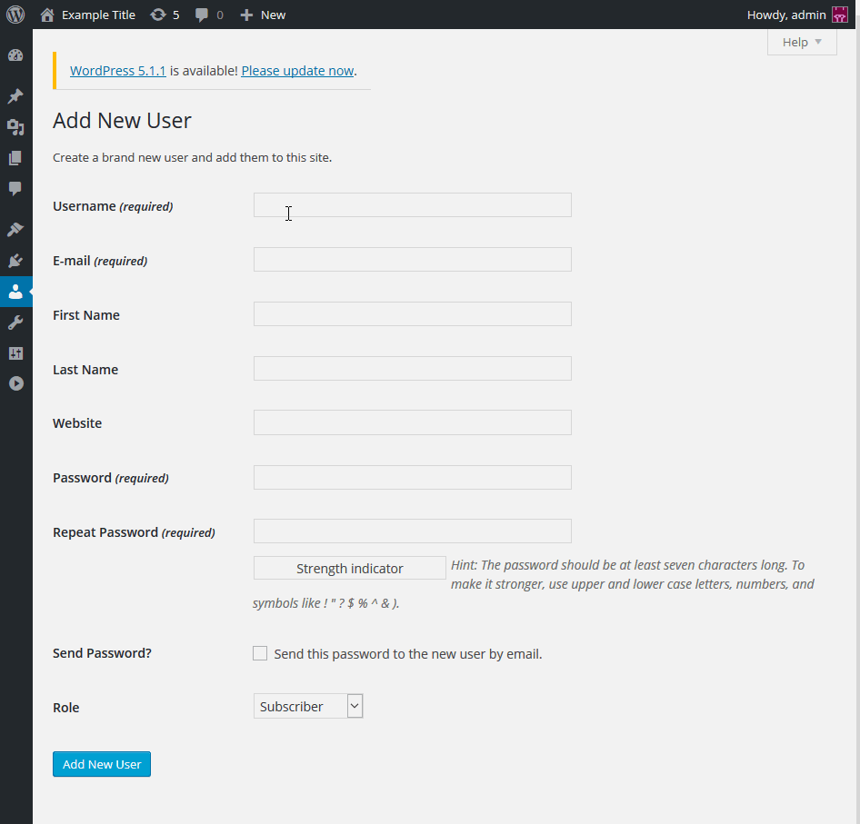
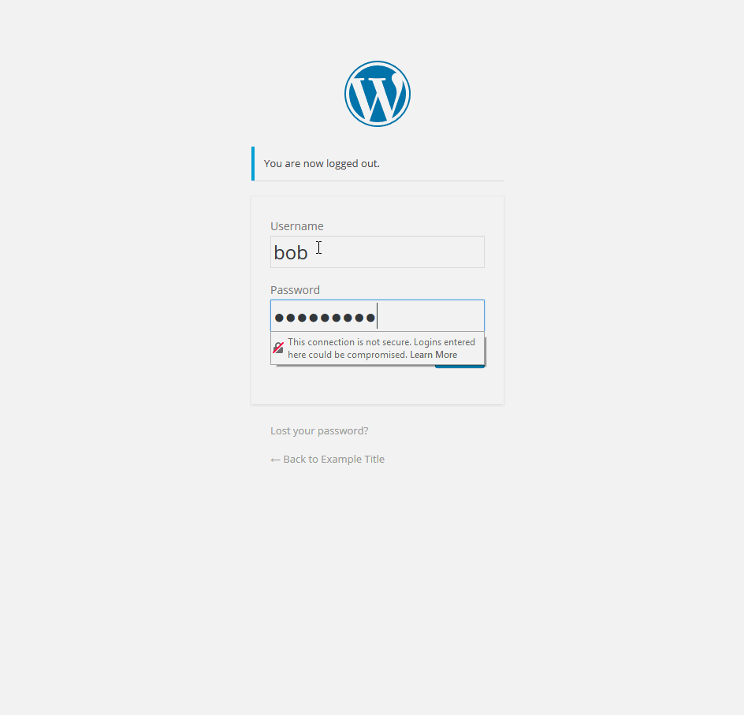
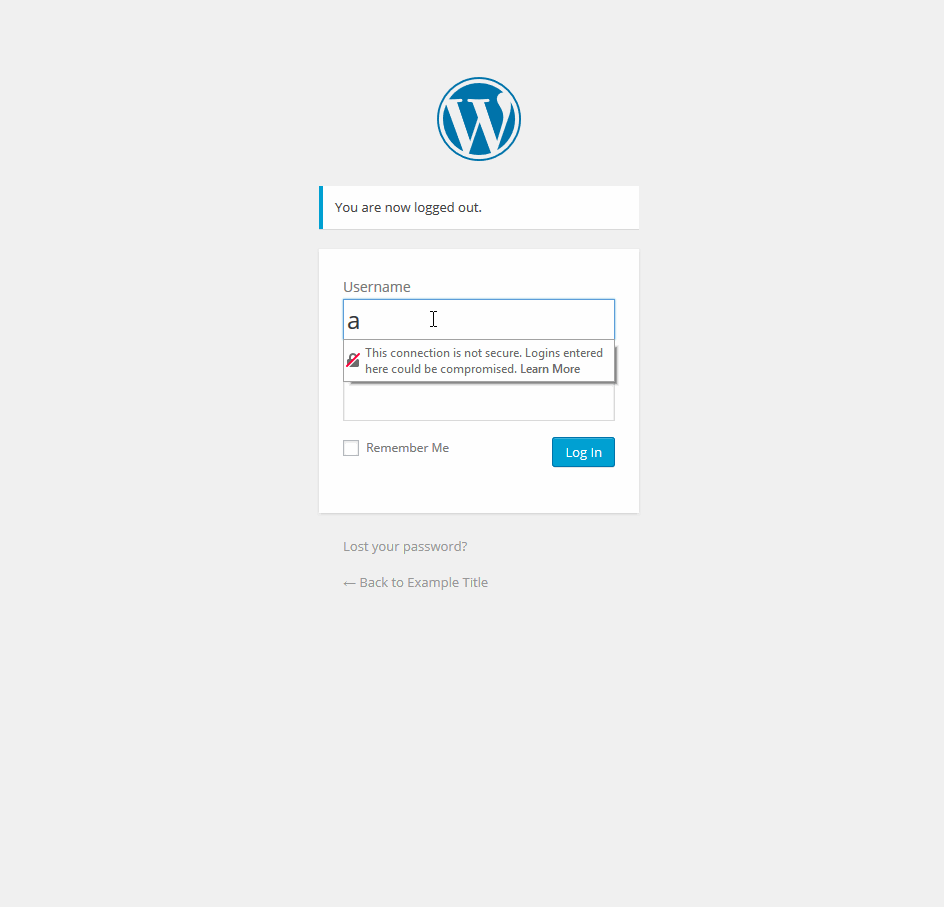

# codepath_week7_8
Private repo for submitting week 7 and 8 assignment. 

# Project 7 - WordPress Pentesting

Time spent: **X** hours spent in total

> Objective: Find, analyze, recreate, and document **five vulnerabilities** affecting an old version of WordPress

## Pentesting Report

1. (Required) Authenticated Stored Cross-Site Scripting (XSS) - CVE-2015-5622
  - [X] Summary: 
    - Vulnerability types: XSS
    - Tested in version: 4.2
    - Fixed in version: 4.2.3
  - [X] GIF Walkthrough:
      
      
      
  - [X] Steps to recreate: 
      1. Create a user that create posts (Author or Contributor)
      2. Login to that user and create a post
      3. Using the HTML input mode, insert html with a HTML DOM Event inside ink tags. 
          Example: `<a href="[caption code=">]</a><a title=" onmouseover=alert('XSS!')  ">link</a>`
      4. Log out of the user and login as an administrator.
      5. View the page and hover over the link.
  - [X] Affected source code:
    - [Source File](https://core.trac.wordpress.org/browser/trunk/src/wp-includes/class-wp-embed.php?rev=33359)
1. (Required) Vulnerability Name or ID
  - [ ] Summary: 
    - Vulnerability types:
    - Tested in version:
    - Fixed in version: 
  - [ ] GIF Walkthrough: 
  - [ ] Steps to recreate: 
  - [ ] Affected source code:
    - [Link 1](https://core.trac.wordpress.org/browser/tags/version/src/source_file.php)
1. (Required) Vulnerability Name or ID
  - [ ] Summary: 
    - Vulnerability types:
    - Tested in version:
    - Fixed in version: 
  - [ ] GIF Walkthrough: 
  - [ ] Steps to recreate: 
  - [ ] Affected source code:
    - [Link 1](https://core.trac.wordpress.org/browser/tags/version/src/source_file.php)
1. (Optional) Vulnerability Name or ID
  - [ ] Summary: 
    - Vulnerability types:
    - Tested in version:
    - Fixed in version: 
  - [ ] GIF Walkthrough: 
  - [ ] Steps to recreate: 
  - [ ] Affected source code:
    - [Link 1](https://core.trac.wordpress.org/browser/tags/version/src/source_file.php)
1. (Optional) Vulnerability Name or ID
  - [ ] Summary: 
    - Vulnerability types:
    - Tested in version:
    - Fixed in version: 
  - [ ] GIF Walkthrough: 
  - [ ] Steps to recreate: 
  - [ ] Affected source code:
    - [Link 1](https://core.trac.wordpress.org/browser/tags/version/src/source_file.php) 

## Assets

List any additional assets, such as scripts or files

## Resources

- [WordPress Source Browser](https://core.trac.wordpress.org/browser/)
- [WordPress Developer Reference](https://developer.wordpress.org/reference/)

GIFs created with [LiceCap](http://www.cockos.com/licecap/).

## Notes

Describe any challenges encountered while doing the work

## License

    Copyright [2019] [Lee Ward]

    Licensed under the Apache License, Version 2.0 (the "License");
    you may not use this file except in compliance with the License.
    You may obtain a copy of the License at

        http://www.apache.org/licenses/LICENSE-2.0

    Unless required by applicable law or agreed to in writing, software
    distributed under the License is distributed on an "AS IS" BASIS,
    WITHOUT WARRANTIES OR CONDITIONS OF ANY KIND, either express or implied.
    See the License for the specific language governing permissions and
    limitations under the License.
